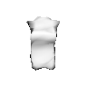

# Introduction

This repository contains implementations of two differentiable 3D mesh renderers using PyTorch:
- `mesh_renderer`: A port of Google's [tf_mesh_renderer](https://github.com/google/tf_mesh_renderer) from Tensorflow to PyTorch. Based on the barycentric formulation from [Genova et al. 2018 "Unsupervised training for 3d morphable model regression."](https://openaccess.thecvf.com/content_cvpr_2018/papers/Genova_Unsupervised_Training_for_CVPR_2018_paper.pdf)
- `soft_mesh_renderer`: An alternate implementation of [SoftRas](https://github.com/ShichenLiu/SoftRas) that I built for my own learning. Based on the probabilistic rasterization formulation by [Liu et al. 2019 "Soft Rasterizer: A Differentiable Renderer for Image-based 3D Reasoning"](https://arxiv.org/abs/1904.01786).




# Setup

1. Create a virtual environment with `python3 -m venv env`
2. Activate it with `source env/bin/activate`
3. Install external dependencies with `pip install -r requirements.txt`

Some additional setup is required to use the optimized kernel for the barycentric renderer.

# Running examples
To run the examples, after activating the virtual environment.
```
python -m src.examples.example1b
```

# Note
Python-only versions of these rasterizers are slow. Some basic optimizations, like vectorizing calculations and using quad trees to remove triangles outside the blur radius, can help, but the lack of parallel processing is a big issue, especially as the screen size increases. Rebuilding the computation graph and running backpropagation also takes up a lot of resources. In production, developers often manually calculate the forward and backward passes to avoid the extra overhead of auto-grad, though this can make the code harder to understand. To improve performance, many use C++ (which offers better parallelism with threads and more control over memory) or CUDA (which uses the GPU to speed up rasterization).